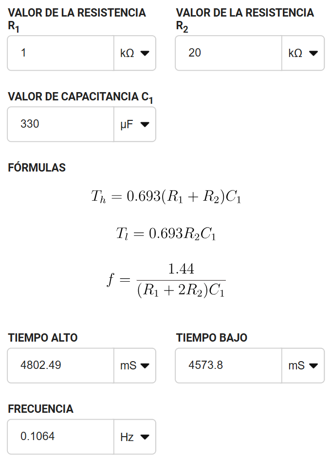
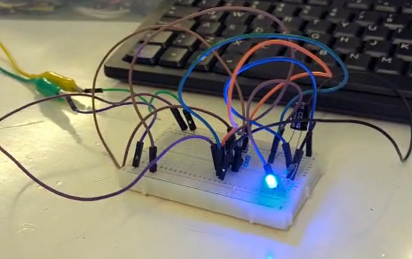
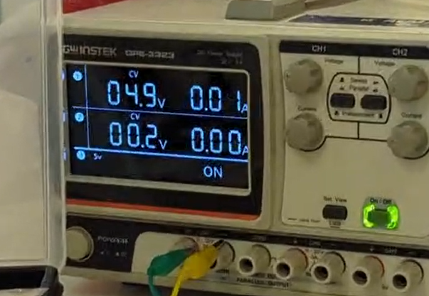

# 📚 Documentación de la Práctica – Temporizador 555 (modo Astable)

---

# 1) Resumen

- ## **Nombre del proyecto:** Oscilador Astable con 555
- ## **Equipo / Autor(es):** Alessandro Reyes, Jose Góngora, Sebastián Cortes
- ## **Curso / Asignatura:** Introduccion a la mecatronica / Circuitos Digitales
- ## **Fecha:** 05/09/2025  
- ## **Descripción breve**: Se diseñó un circuito con el temporizador 555 en modo astable para encender y apagar un LED cada 3–5 segundos, armado de forma física y documentado con evidencia en fotos y video.

# -----------------------------------

# 2) Objetivos

## **General:** Implementar un circuito oscilador astable con el CI 555 para controlar el parpadeo de un LED.
## **Específicos:** 
## - Diseñar el circuito con valores adecuados de resistencias y capacitores.
## - Calcular teóricamente los tiempos alto y bajo de la señal.
## - Verificar en la práctica el correcto parpadeo del LED.
## - Comparar resultados teóricos y experimentales.

# -----------------------------------

# 3) Alcance y Exclusiones

## **Incluye:**
### - Implementación en protoboard del 555 en modo astable.
### - LED parpadeando con periodo de 3–5 segundos.
### - Documentación de cálculos y resultados.
### - Evidencia en fotos y video. 

## - **No incluye:** 
### - Diseño de PCB.
### - Simulación en software especializado.
### - Implementación con microcontroladores.

# -----------------------------------

# 4) Requisitos

## **Hardware**
##  - 1 × CI 555
### - 1 × Resistencia R1 = 1 kΩ
### - 1 × Resistencia R2 = 20 kΩ
### - 1 × Capacitor electrolítico C1 = 330 µF
### - 1 × LED + resistencia limitadora (330 Ω – 1 kΩ)
### - Fuente de alimentación (5–9 VDC)
### - Protoboard y cables

## **Conocimientos previos**
### - Conocimientos previos - Ley de Ohm y cálculo de resistencias
### - Funcionamiento del temporizador 555
### - Uso de protoboard y multímetro

# -----------------------------------

# 5) Instalación

## 1. Armar el circuito según el diagrama:

## **(Diagrama del temporizador 555 en modo astable)**

## **(Calculos teoricos del Circuito)**
## Observación práctica: 
### El LED permanece encendido ~4.8 s y apagado ~4.6 s, cumpliendo con el requisito (3–5s).

# -----------------------------------

# 6) Resultados

## ✅ LED parpadea dentro del rango esperado (aprox. 9.3 s de periodo total).
## ✅ El comportamiento práctico coincide con las fórmulas.
## ✅ El 555 demostró ser un generador confiable de pulsos de baja frecuencia.

## **Fotos del montaje físico:**
### Figura 3. Montaje físico – Vista 1

### Figura 4. Montaje físico – Vista 2

